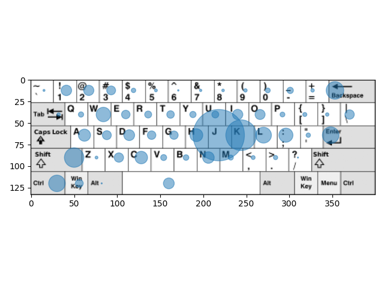

keyboard-analyse
================

The project created for help people who want to switch other keyboard layout.

## Using

To start, collect data about keyboard activity run commad:

``python app.py start``

This starts recording in ``~/.pylogger.log``. You can change the path to file easy, just run command:

``echo "export pylogger_file="<new_path>" && source ~/.profile``

To make a scatter plot run command:

``python app.py analyse``
